# Showtime ticketing platform — architecture

## 1. Purpose and scope

Showtime is a full-stack movie-ticketing application. It supports two roles:

- **Moviegoer**: creates an account, discovers a published movie showtime, selects live seats, holds them for ten minutes, completes a demo payment, receives QR-enabled tickets, and retrieves past bookings.
- **Organizer**: creates and publishes movie showtimes, controls the seat inventory, configures dynamic pricing, monitors occupancy and revenue, reviews orders and price changes, and validates tickets at the cinema door.

The application is intentionally designed around seat-level inventory. A seat is not merely a label in the UI: it has a current price, an availability state, a version, a reservation history, a price history, and eventually one ticket.

## 2. Technology choices

| Layer | Technology | Responsibility |
| --- | --- | --- |
| Web application | Next.js 16 App Router and React 19 | Pages, layouts, client interactions, and Route Handlers |
| UI | Tailwind CSS, shadcn/Base UI, Lucide icons | Responsive, accessible interface primitives |
| Persistence | PostgreSQL | Transactional source of truth for accounts, seats, reservations, orders, and tickets |
| ORM | Prisma 7 with `@prisma/adapter-pg` | Typed schema, database queries, migrations, and transactions |
| Authentication | Signed HMAC session cookie + Node crypto | Password hashing, browser session, role checks |
| QR tickets | `qrcode.react` | Renders the ticket-code payload as a QR entry pass |

## 3. High-level system view

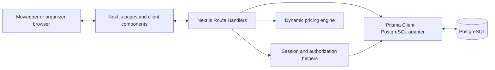

The App Router keeps pages and layouts server-rendered by default. Components which need browser state—seat selection, authentication dialog, checkout countdown, booking lists, and organizer management—are Client Components and call the Route Handler API with `fetch`.

## 4. Repository map

```text
src/
├── app/
│   ├── page.tsx                         Home / discovery page
│   ├── movies/[eventId]/page.tsx        Seat-selection page
│   ├── checkout/[reservationId]/page.tsx Checkout and QR confirmation
│   ├── tickets/page.tsx                 Moviegoer's booked tickets
│   ├── admin/page.tsx                   Organizer-only dashboard
│   └── api/                             HTTP Route Handlers
├── components/
│   ├── auth/                            Sign-up / sign-in dialog
│   ├── home/                            Movie discovery UI
│   ├── movies/                          Seat map and booking summary
│   ├── checkout/                        Reservation countdown and payment UI
│   ├── tickets/                         QR ticket cards
│   ├── admin/                           Organizer workspace and manager
│   └── site/                            Header, account display, footer
├── lib/
│   ├── auth.ts                          Cookie signing and password helpers
│   ├── current-user.ts                  Database-backed user and organizer checks
│   ├── pricing.ts                       Pure dynamic-price calculation
│   └── prisma.ts                        Prisma singleton
└── generated/prisma/                    Generated Prisma client

prisma/
├── schema.prisma                        Database data model
├── migrations/                          PostgreSQL migration history
└── seed-movies.sql                      Development movie and seating seed
```

## 5. Request and rendering architecture

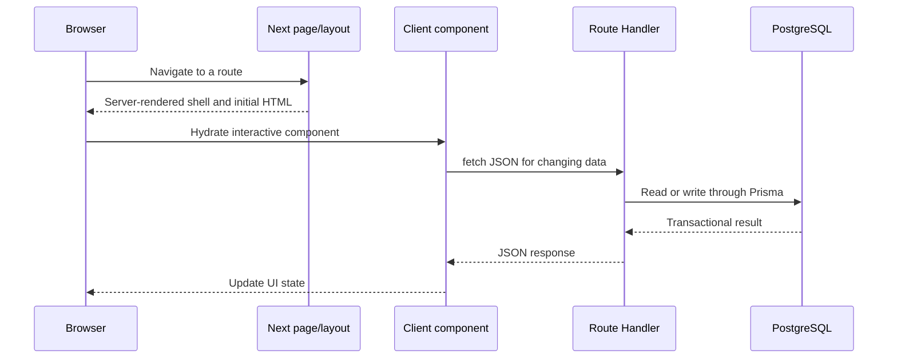

Why this split matters:

- Navigation, global layout, metadata, and authorization redirect decisions can stay on the server.
- Interactive surfaces do not need a separate backend service. They call typed, same-origin Route Handlers.
- Database credentials and session signing secrets never enter the browser bundle.

## 6. Authentication and authorization

### Account lifecycle

Registration accepts a name, validated email, password of at least eight characters, and an optional organizer role. Passwords use a randomly generated 16-byte salt plus Node `scrypt`; the stored value is `salt:derivedKey`.

After registration or login, the server creates a 14-day HMAC-SHA256 signed session payload. The browser receives it in the `ticketly_session` cookie, configured with `httpOnly`, `sameSite=lax`, `path=/`, and `secure` in production.

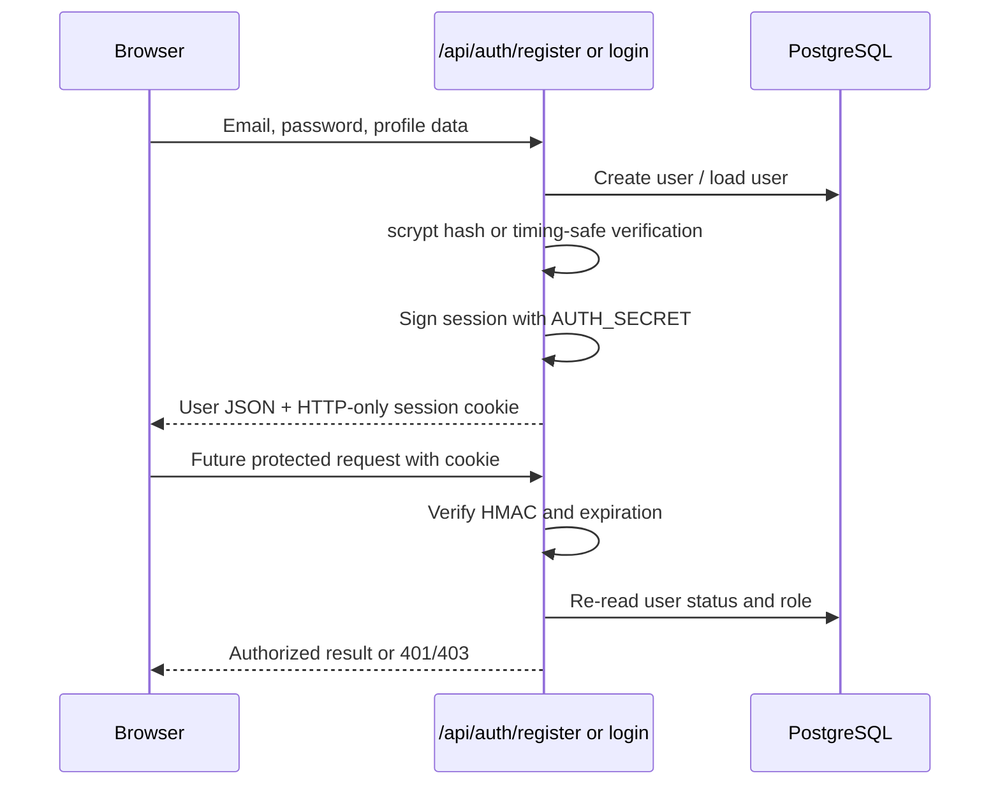

`getCurrentUser()` deliberately re-reads the user record on protected requests. This means a block or a role change takes effect even if an old session cookie is still cryptographically valid. `getOrganizer()` adds the `ORGANIZER` role requirement.

### Authorization policy

| Capability | Who may use it | Enforcement |
| --- | --- | --- |
| Browse published future movies | Anyone | Public movie endpoints |
| Reserve, pay, view personal tickets | Signed-in user | Current user must own reservation/order |
| Dashboard and event management | Organizer | `getOrganizer()` + event `organizerId` ownership |
| Ticket validation | Organizer | Ticket must belong to a show owned by organizer |

## 7. Core data model

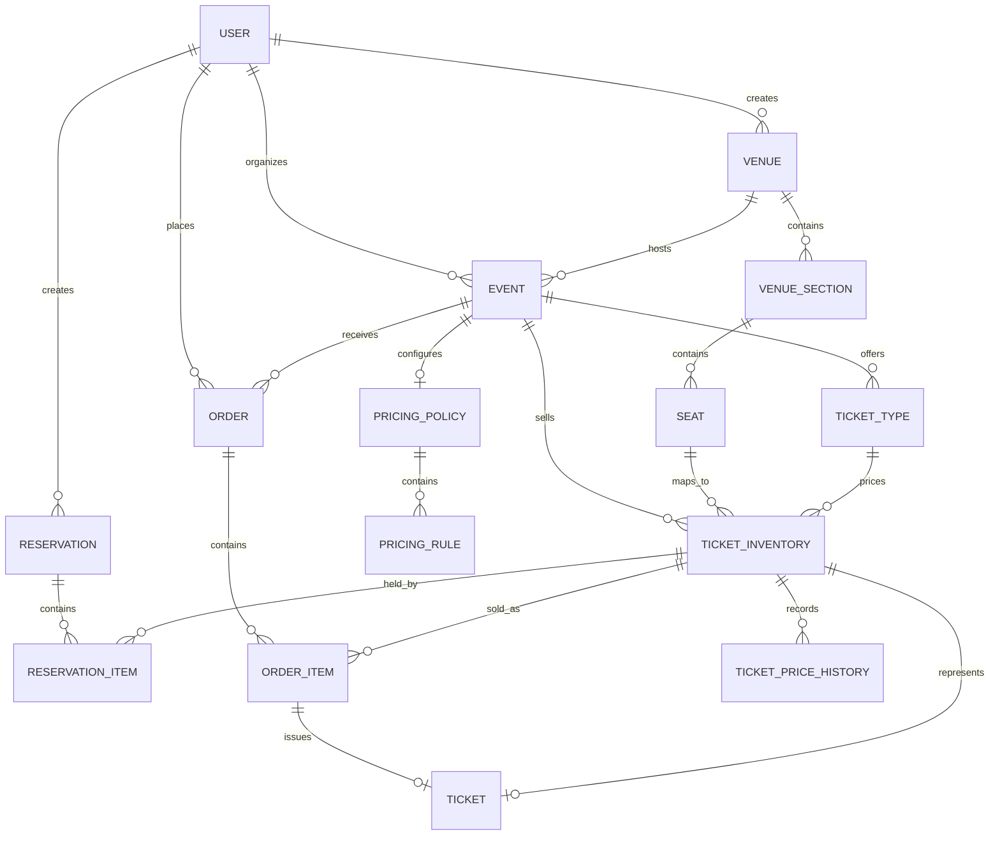

### Important entities

| Entity | Key fields | Why it exists |
| --- | --- | --- |
| `User` | role, status, password hash | Account identity and access control |
| `Venue`, `VenueSection`, `Seat` | city, sections, row/seat number | Stable physical cinema layout |
| `Event` | movie metadata, schedule, status, organizer | A specific screening at a venue |
| `TicketType` | name, base price, quantity | Commercial category such as Classic, Prime, Recliner |
| `TicketInventory` | event+seat, current price, status, version | The sellable unit and source of live availability |
| `Reservation` | owner, expiration, status | Ten-minute temporary seat hold |
| `Order` / `OrderItem` | final amount and locked unit price | Immutable commercial record after payment |
| `Ticket` | unique ticket code, active/used status | One admission credential per paid seat |
| `PricingPolicy` / `PricingRule` | bounds, type, conditions, priority | Event-level dynamic-price configuration |
| `TicketPriceHistory` | price, reason, timestamp | Audit trail for each displayed price change |

The key constraints are also business safeguards: one inventory row per `(eventId, seatId)`, one reservation item per seat/reservation, one order item per seat/order, and one ticket per inventory item/order item.

## 8. Movie discovery and seat-selection flow

`GET /api/movies` returns published future movie events. `GET /api/movies/[eventId]` returns an individual published showtime with its venue, seat inventory, ticket types, and active pricing policy.

The booking page displays every physical seat grouped by section and row. It allows up to six selected inventory records. The displayed booking total is always the sum of the current prices returned by the server; the browser never calculates a price rule itself.

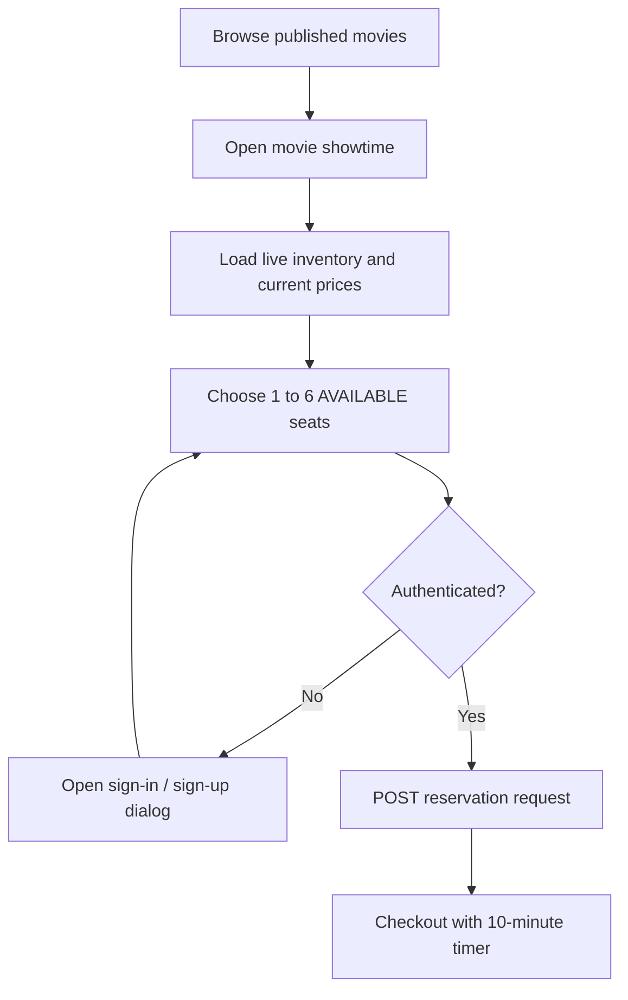

Unavailable inventory is rendered as unavailable. `HELD`, `SOLD`, and `BLOCKED` are never selectable by a moviegoer.

## 9. Dynamic pricing

### Design

Prices are computed server-side from a ticket type's base price and an ordered set of enabled rules. A policy also provides an absolute minimum and maximum price. Rules apply only when their condition matches and may optionally target a ticket type.

Supported rule types:

| Rule | Example condition | Typical effect |
| --- | --- | --- |
| `INVENTORY` / `DEMAND` | remaining seats ≤ 30% | Increase price as capacity becomes scarce |
| `WEEKEND` | movie starts Saturday/Sunday | Weekend premium |
| `EARLY_BIRD` | at least 72 hours remaining | Early-purchase saving |
| `LAST_MINUTE` / `TIME` | fewer than four hours left | Time-sensitive price change |

Supported adjustment types are percentage, fixed amount, and multiplier. Rules are evaluated in descending priority order, then the result is clamped to the pricing policy bounds and rounded to two decimals.

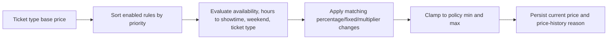

### When prices refresh

1. A movie detail request refreshes current prices before returning the live seat map.
2. A reservation request refreshes eligible inventory before placing its hold.
3. An organizer can explicitly use **Price now** from the dashboard.
4. Ticket base-price edits immediately update available seats when dynamic pricing is disabled. Existing order-item prices are never changed.

Pricing calculations are deliberately repeated server-side immediately before a hold. A browser may show a recently refreshed price, but only the database-backed inventory price is used when an order is created.

## 10. Seat reservation, payment, and QR ticket issue

### State machine

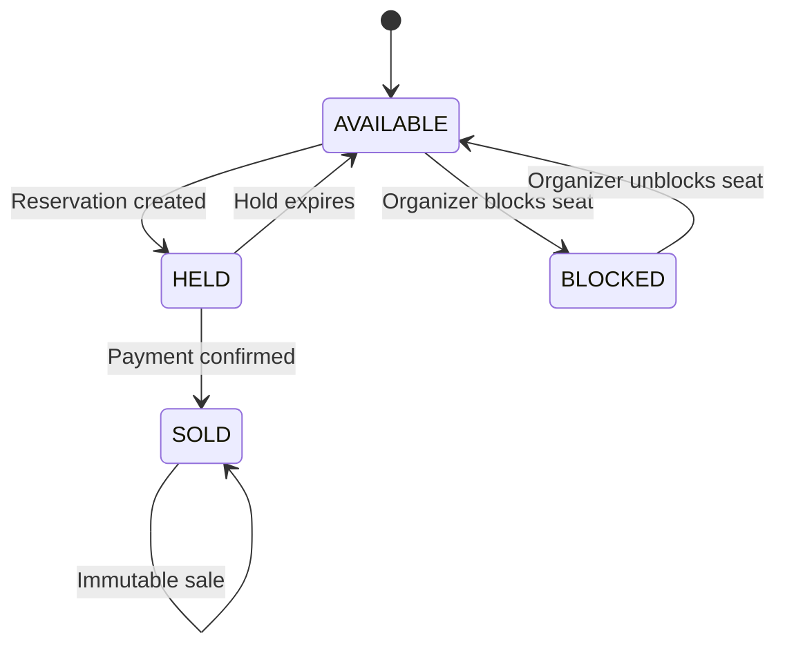

### Reservation logic

`POST /api/reservations` accepts one to six unique inventory IDs belonging to a published future event. It runs in a serializable PostgreSQL transaction:

1. Find and expire old active holds for the event, releasing their held inventory.
2. Atomically update only `AVAILABLE` requested inventory rows to `HELD`.
3. Confirm exactly the requested number of rows changed; otherwise a competing booking won and the caller receives `409 Conflict`.
4. Create a `Reservation` and `ReservationItem` rows with an expiry ten minutes in the future.

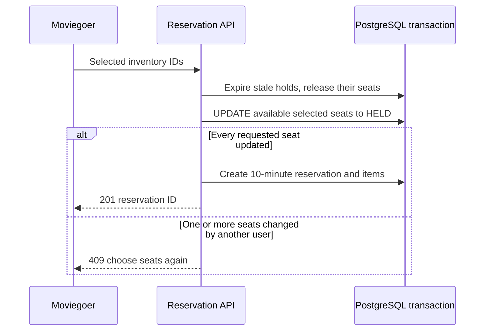

### Demo payment and ticket issue

`POST /api/payments/confirm` is a payment-provider boundary implemented as an immediate demo success today. It uses a serializable transaction and is idempotent for a completed reservation.

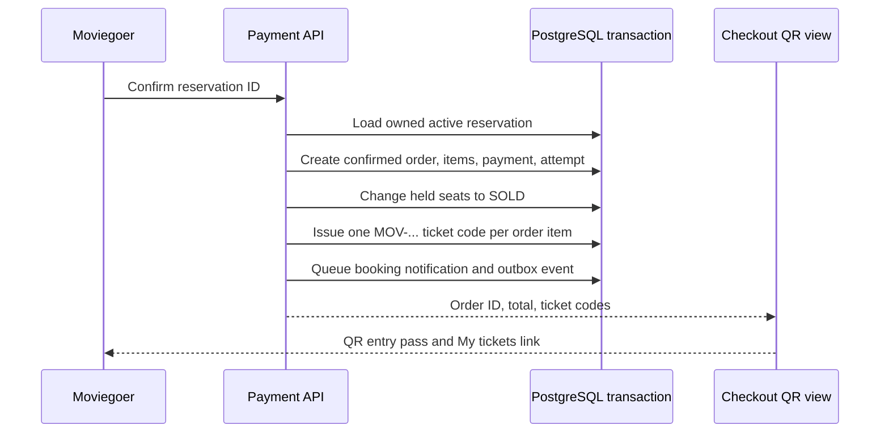

The order item stores the price paid at payment time. This preserves the financial record even when pricing rules later update currently available seats. The combined ticket-code payload is rendered as a QR on the confirmation screen and in the moviegoer's ticket list.

## 11. Moviegoer features

| Feature | UI | API / logic |
| --- | --- | --- |
| Account creation and sign-in | Header authentication dialog | Password hashing, signed session cookie, role selection |
| Visible form input | Shared `Input` component | Explicit foreground and caret styling fixes invisible typed text |
| Profile identification | Header account button | Shows user initials and display name; links to My tickets |
| Movie discovery | Home page | Filters published future movies by title/city |
| Live seat choice | Movie detail page | Server-backed inventory status and current prices |
| Seat hold | Booking summary | Up to six seats; ten-minute reservation timer |
| Checkout | Checkout page | Secure demo confirmation, no card data collected |
| QR admission | Checkout and My tickets | `qrcode.react` renders issued ticket codes |
| Booking history | My tickets | Reads only confirmed orders owned by current user |

## 12. Organizer features

The organizer dashboard starts with searchable/filterable showtime cards and summary metrics. **Manage** opens a dedicated showtime manager with the following tabs.

| Manager area | Operations | Server protection |
| --- | --- | --- |
| Details | Edit movie name, description, venue, city, start time | Only event owner may edit; showtime must remain in future |
| Ticket types | Edit names, descriptions, base prices | Updates only ticket types belonging to the organizer's event |
| Pricing rules | Enable/disable policy, set bounds, add/edit/remove rules | Rule type, adjustment type, numeric values, priority, and ticket-type target are validated |
| Seat control | Filter seats and block/unblock eligible seats | Only `AVAILABLE` ⇄ `BLOCKED`; sold and held seats cannot be overridden |
| Sales & history | Occupancy, revenue, recent orders, price changes | Data scoped to event owned by organizer |
| Door entry | Validate a ticket code and check in guest | Ticket must be under a show owned by organizer; only `ACTIVE` can become `USED` |

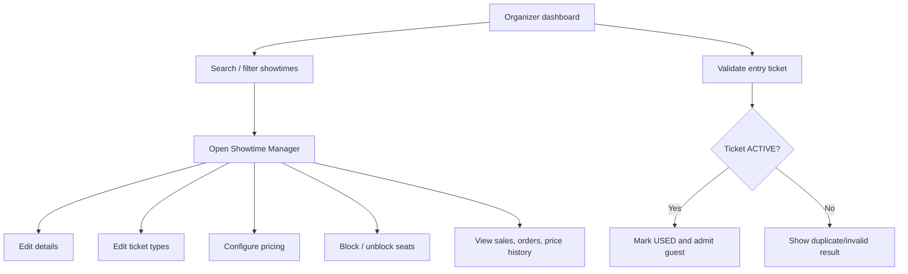

## 13. API map

### Authentication

| Method and route | Purpose |
| --- | --- |
| `POST /api/auth/register` | Create user or organizer account and session |
| `POST /api/auth/login` | Verify password and create session |
| `POST /api/auth/logout` | Remove session cookie |
| `GET /api/auth/session` | Return safe signed-in user profile |

### Moviegoer

| Method and route | Purpose |
| --- | --- |
| `GET /api/movies` | List published future movies |
| `GET /api/movies/[eventId]` | Read live showtime, seats, and current pricing |
| `POST /api/reservations` | Atomically hold requested seats |
| `GET /api/reservations/[reservationId]` | Read an owned reservation and completed order |
| `POST /api/payments/confirm` | Confirm demo payment and issue tickets |
| `GET /api/orders/me` | Read current user's confirmed bookings |

### Organizer

| Method and route | Purpose |
| --- | --- |
| `GET /api/admin/dashboard` | Dashboard showtime summaries |
| `POST /api/admin/events` | Create draft movie, venue, seat plan, ticket types, and starter pricing policy |
| `PATCH /api/admin/events/[eventId]` | Update status and showtime/venue details |
| `GET /api/admin/events/[eventId]/management` | Detailed inventory, pricing, orders, and history |
| `PATCH /api/admin/events/[eventId]/ticket-types` | Update ticket type metadata and prices |
| `PATCH /api/admin/events/[eventId]/pricing` | Update pricing policy and rule set |
| `PATCH /api/admin/events/[eventId]/seats` | Block/unblock one inventory seat |
| `POST /api/pricing/recalculate` | Manually refresh available-seat prices |
| `POST /api/admin/tickets/validate` | Validate and consume an entry ticket |

## 14. Consistency, concurrency, and error handling

### Concurrency controls

- **Serializable transactions** protect reservation and payment state transitions.
- Inventory is changed with state predicates such as `WHERE status = AVAILABLE`; a row is not reserved just because its ID was submitted.
- `TicketInventory.version` increments on state and price changes, providing an audit/concurrency marker for future optimistic-locking extensions.
- Ticket and inventory uniqueness constraints prevent duplicate issuance for a sold seat.
- Completed reservations are checked before creating a new order, so payment confirmation is safe to retry.

### User-facing failures

| Situation | Response |
| --- | --- |
| Not signed in | `401`; UI opens or directs user to account access |
| Non-organizer using admin API | `403` |
| Seat just sold or held by another person | `409` and a clear seat-selection message |
| Expired reservation | `409`; held seats are released and user selects again |
| Invalid pricing payload or ticket operation | `400` with validation message |
| Ticket already used | `409`, preventing duplicate admission |

## 15. Security and privacy notes

- Configure a strong, secret `AUTH_SECRET` in production. The development fallback is deliberately not production-safe.
- Configure `DATABASE_URL` only in server-side environment variables; Prisma throws early if it is absent.
- Password verification uses a timing-safe equality check after scrypt derivation.
- Cookies are HTTP-only and secure in production. No password or raw session value is exposed to React.
- Every organizer mutation verifies both organizer role and event ownership; client-side UI visibility is not the security boundary.
- The current payment provider is a demo. A production provider should use provider-hosted payment collection, webhooks with verified signatures, idempotency keys, and reconciliation before setting orders to `CONFIRMED`.

## 16. Deployment and operations

### Required configuration

```dotenv
DATABASE_URL=postgresql://...
AUTH_SECRET=long-random-production-secret
NODE_ENV=production
```

### Build and database workflow

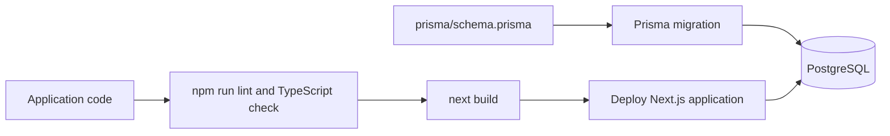

Prisma configuration is in `prisma7.config.ts`; migrations reside in `prisma/migrations`. For local demonstration data, `prisma/seed-movies.sql` creates a sample cinema layout and movie after a user exists.

## 17. Current boundaries and recommended next steps

The architecture is ready for a production-grade expansion, but these are intentional next integrations rather than features that should be silently assumed:

1. Replace demo payment confirmation with a payment gateway and signed webhook flow.
2. Add a scheduled worker to expire reservations and refresh time-based prices even when no browser requests occur.
3. Add an authenticated scanner application or camera QR scanner to the ticket-validator UI; the current validator supports typed/pasted ticket codes.
4. Add outbound notification delivery for pending notification and outbox records.
5. Add audit-log writes for organizer actions and operational reporting dashboards.
6. Add automated integration tests around concurrent holds, idempotent payment confirmation, pricing boundaries, and ticket validation.

This separation—physical seat inventory, short-lived reservations, immutable paid orders, and one-time tickets—keeps the product extensible while preserving the most important invariants of a real ticketing system.
